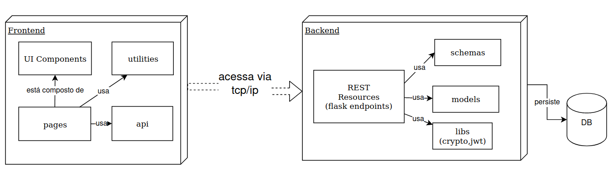
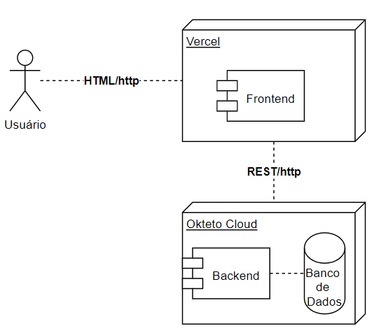

# Arquitetura

O seguinte modelo ilustra a estrutura do componente de login e sua divisão em dois componentes, o frontend e o backend que se comunicam via o protocolo HTTP utilizando endpoints REST.&#x20;

Na versão de produção, é usado um banco de dados Postgresql  onde são armazenados os registros de usuários.

Na versão em produção, o Frontend está hospedado na nuvem do [Vercel](https://vercel.com/docs), empresa criadora do framework Nextjs e que fornece um ambiente de execução de frontends. Por sua parte, o Backend junto com o banco de dados, está em execução na plataforma [Okteto Cloud](https://okteto.com/) que oferece um ambiente gratuito de execução computacional, baseado em kubernetes.&#x20;

