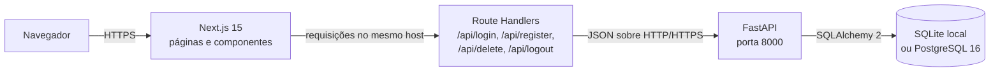
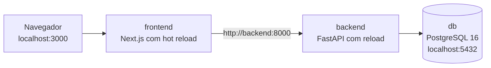
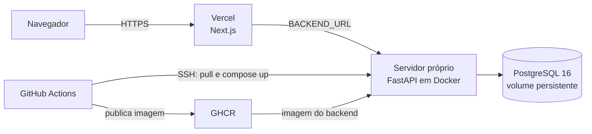

# Arquitetura

O sistema é dividido em frontend, backend e banco de dados. A mudança mais
importante em relação à versão original é a presença de uma camada BFF
(*Backend for Frontend*) dentro do Next.js: o navegador chama `/api/*` no mesmo
host do frontend, e os Route Handlers chamam o FastAPI pelo lado do servidor.

```mermaid
flowchart LR
    U[Navegador]
    F[Next.js 15<br/>páginas e componentes]
    BFF[Route Handlers<br/>/api/login, /api/register,<br/>/api/delete, /api/logout]
    API[FastAPI<br/>porta 8000]
    DB[(SQLite local<br/>ou PostgreSQL 16)]

    U -->|HTTPS| F
    F -->|requisições no mesmo host| BFF
    BFF -->|JSON sobre HTTP/HTTPS| API
    API -->|SQLAlchemy 2| DB
```

## Responsabilidades

### Navegador e frontend

- renderizam as páginas `/`, `/register` e `/profile`;
- validam formulários com Zod e React Hook Form;
- mantêm o token de acesso em um cookie `httpOnly` criado pelo servidor Next.js;
- impedem o acesso casual a `/profile` sem cookie por meio de `middleware.ts`;
- validam o JWT no Server Component do perfil.

### Backend

- valida os payloads HTTP com Pydantic;
- consulta e persiste usuários com SQLAlchemy;
- gera e verifica hashes de senha com bcrypt;
- emite tokens JWT de acesso e renovação usando HS256;
- expõe documentação OpenAPI em `/docs`;
- cria as tabelas conhecidas na inicialização com
  `Base.metadata.create_all`.

### Banco de dados

- SQLite é o padrão quando o backend roda diretamente;
- PostgreSQL 16 é usado pelos ambientes Docker de desenvolvimento e produção;
- a tabela `users` guarda `id`, `username`, `email` e o hash em `password`.

## Segredo compartilhado

O backend assina os tokens com `JWT_SECRET_KEY`. O frontend valida essa
assinatura com `JWT_SECRET`. Os dois valores precisam ser idênticos; os segredos
são usados somente no lado do servidor e não devem ser prefixados com
`NEXT_PUBLIC_`.

## Desenvolvimento

`infra/docker-compose.dev.yml` executa os três serviços:

```mermaid
flowchart LR
    N[Navegador<br/>localhost:3000]
    FE[frontend<br/>Next.js com hot reload]
    BE[backend<br/>FastAPI com reload]
    PG[(db<br/>PostgreSQL 16<br/>localhost:5432)]
    N --> FE
    FE -->|http://backend:8000| BE
    BE --> PG
```

O código do frontend e de `backend/app` é montado nos contêineres para permitir
recarga durante o desenvolvimento.

## Produção

```mermaid
flowchart LR
    U[Navegador]
    V[Vercel<br/>Next.js]
    S[Servidor próprio<br/>FastAPI em Docker]
    P[(PostgreSQL 16<br/>volume persistente)]
    G[GitHub Actions]
    R[GHCR]

    U -->|HTTPS| V
    V -->|BACKEND_URL| S
    S --> P
    G -->|publica imagem| R
    G -->|SSH: pull e compose up| S
    R -->|imagem do backend| S
```

O frontend é publicado na Vercel com raiz `frontend`. O backend e o PostgreSQL
rodam em `infra/docker-compose.prod.yml` no servidor. A porta do banco não é
publicada; apenas o backend a acessa pela rede interna do Compose.

Os arquivos `okteto-pipeline.yml` e `k8s/` permanecem no repositório por
compatibilidade histórica, mas estão obsoletos e não fazem parte da arquitetura
de implantação atual.
