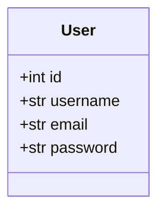
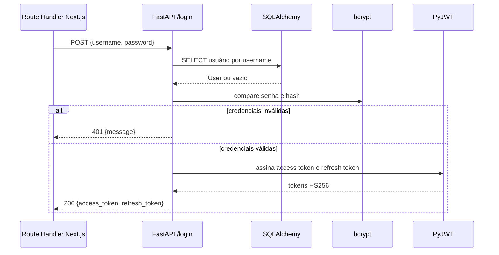

# Projeto do backend

O backend foi reescrito em FastAPI para Python 3.14. Ele usa SQLAlchemy 2 para
persistência, Pydantic 2 para contratos, bcrypt para senhas e PyJWT para tokens.

## Organização do código

| Caminho | Papel |
| --- | --- |
| `app/main.py` | cria o FastAPI, configura CORS, erros e ciclo de vida |
| `app/api/v1/router.py` | agrega as rotas, mantidas na raiz por compatibilidade |
| `app/api/v1/endpoints/auth.py` | cadastro, login, logout e refresh |
| `app/api/v1/endpoints/users.py` | consulta e remoção de usuários |
| `app/api/v1/endpoints/health.py` | status funcional e healthcheck |
| `app/core/config.py` | configuração baseada no ambiente |
| `app/core/security.py` | bcrypt e criação/decodificação de JWT |
| `app/core/deps.py` | autenticação Bearer e usuário atual |
| `app/db/session.py` | engine, sessões e base declarativa |
| `app/models/user.py` | modelo SQLAlchemy da tabela `users` |
| `app/schemas/user.py` | schemas Pydantic de entrada e saída |

## Modelo persistido

- `id` é chave primária autoincrementada;
- `username` é obrigatório, único, indexado e limitado a 80 caracteres;
- `email` é único e indexado; o cadastro exige e-mail válido de até 80
  caracteres;
- `password` armazena somente o hash bcrypt, com espaço para 255 caracteres.

## Endpoints

| Método | Rota | Autenticação | Sucesso |
| --- | --- | --- | --- |
| GET | `/` | não | 200 com identificação da API |
| GET | `/status` | não | 200 `{"message":"Servidor funcionando corretamente"}` |
| GET | `/health` | não | 200 `{"status":"ok"}` |
| POST | `/register` | não | 201 com mensagem |
| POST | `/login` | não | 200 com `access_token` e `refresh_token` |
| POST | `/logout` | Bearer access token | 200 com mensagem |
| POST | `/refresh` | Bearer refresh token | 200 com novo `access_token` |
| GET | `/user/{id}` | não | 200 com `id`, `username` e `email` |
| DELETE | `/user/{id}` | não | 200 com mensagem |
| DELETE | `/remove/{username}` | não | 200 com mensagem |


As rotas de consulta e remoção de usuário não exigem autenticação na
implementação atual. Isso preserva o contrato didático/legado, mas deve ser
revisto antes de reutilizar o código em um sistema real.


Erros de negócio são normalizados como `{"message":"..."}`. Falhas de validação
usam HTTP 422 e acrescentam o campo `errors`. Usuário ou e-mail duplicado retorna
400; credenciais inválidas e tokens inválidos retornam 401; usuário inexistente
retorna 404.

## Fluxo de login

O access token contém `sub`, `type=access`, `jti`, `iat`, `exp`, `username` e
`email`. O refresh token contém os campos de identidade e validade, mas não os
dados de perfil.


Na implementação atual, `POST /refresh` gera um access token sem `username` e
`email`. A interface não usa esse endpoint; se a renovação for integrada ao
frontend, o token renovado também precisará carregar os dados exigidos por
`verifyToken`.


## Sessão e logout

O backend é stateless. `POST /logout` valida o access token e devolve uma
mensagem, mas não revoga o JWT. No fluxo da interface, o logout efetivo ocorre
quando o Route Handler do Next.js remove o cookie.

## Banco e ciclo de vida

`DATABASE_URL` cria o engine com `pool_pre_ping=True`. SQLite recebe a opção
`check_same_thread=False`. Em cada requisição, a dependência `get_db` abre uma
sessão e a fecha ao final. Na inicialização da aplicação, o SQLAlchemy executa
`Base.metadata.create_all`; o projeto não possui ferramenta de migrações.
