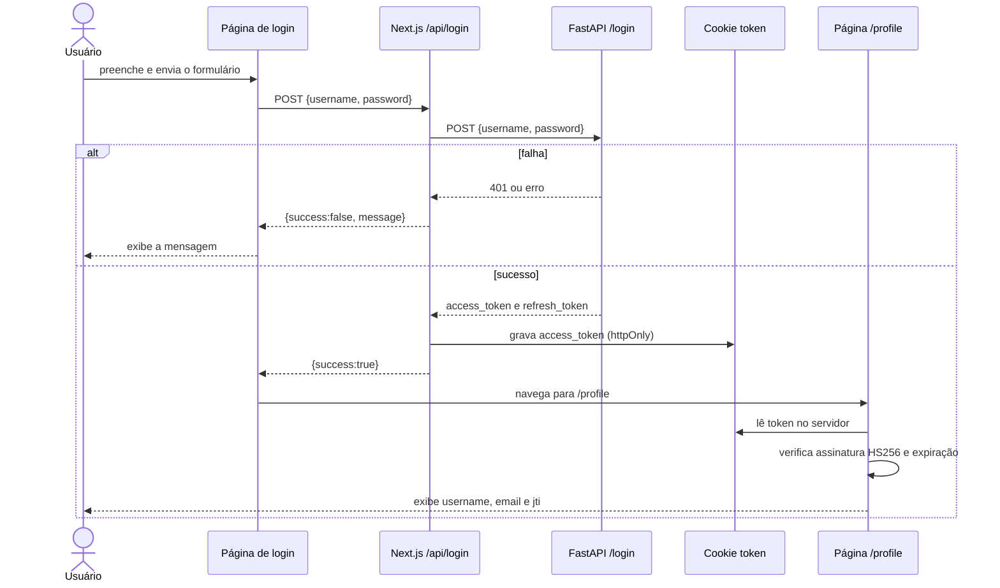

# Projeto do frontend

O frontend foi modernizado para Next.js 15, React 19 e TypeScript. Ele usa o
App Router: páginas, layout, Server Components e Route Handlers ficam sob a
pasta `app`.

## Organização

| Caminho | Responsabilidade |
| --- | --- |
| `app/layout.tsx` | layout global, metadados, logotipo e rodapé |
| `app/page.tsx` | tela de login |
| `app/register/page.tsx` | tela de cadastro |
| `app/profile/page.tsx` | perfil renderizado no servidor |
| `app/api/login/route.ts` | proxy de login e criação do cookie |
| `app/api/register/route.ts` | proxy de cadastro |
| `app/api/delete/route.ts` | proxy de remoção usado pelos testes |
| `app/api/logout/route.ts` | remoção do cookie |
| `components/` | formulários, botões, cabeçalho e cartão de perfil |
| `lib/schemas.ts` | validação Zod dos formulários |
| `lib/backend.ts` | URL e cliente Axios para o backend |
| `lib/auth.ts` | nome do cookie e validação JWT com `jose` |
| `middleware.ts` | redireciona `/profile` quando não há cookie |

## Páginas

- `/`: Client Component com formulário de nome de usuário e senha;
- `/register`: Client Component com nome, e-mail e senha;
- `/profile`: Server Component dinâmico que lê o cookie, verifica o JWT e mostra
  os dados contidos no próprio token.

Os formulários usam React Hook Form com `zodResolver`. Mensagens de validação
aparecem no cliente; mensagens de negócio e conexão vêm dos Route Handlers.

## BFF e cookie de sessão

O navegador não acessa o FastAPI diretamente no fluxo da interface. Os Route
Handlers recebem as requisições em `/api/*` e usam `BACKEND_URL` para falar com
o backend. Essa separação permite manter `BACKEND_URL` e `JWT_SECRET` somente no
servidor.

No login bem-sucedido, `/api/login` salva o access token:

| Atributo do cookie | Valor |
| --- | --- |
| nome | `token` |
| `httpOnly` | `true` |
| `sameSite` | `lax` |
| `path` | `/` |
| `secure` | `true` somente quando `NODE_ENV=production` |
| `maxAge` | 1.800 segundos (30 minutos) |

O endpoint retorna o token também no corpo JSON, embora a página de login use
apenas o indicador `success`. O refresh token devolvido pelo backend não é
armazenado no frontend atual.

## Fluxo completo

`middleware.ts` verifica apenas a presença do cookie antes de `/profile`. A
validação criptográfica é feita depois, por `verifyToken` na própria página. Um
cookie inválido permite chegar à rota, mas o perfil exibe uma mensagem de erro.

## Build para contêiner

Quando `DOCKER_BUILD=1`, `next.config.ts` ativa `output: "standalone"`. O
Dockerfile usa esse artefato na imagem de produção. Na Vercel, a opção não
prejudica o build e não precisa ser configurada manualmente.
