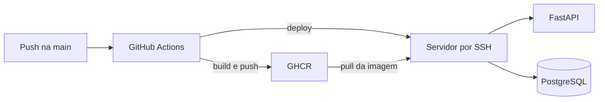

# Backend

A implantação atual substitui o Okteto. O GitHub Actions constrói a imagem do
FastAPI, publica no GitHub Container Registry (GHCR) e acessa o servidor por SSH
para atualizar os serviços `backend` e `db`.



## 1. Preparar o servidor

Use Ubuntu ou Debian com acesso root. Depois de clonar o repositório no
servidor:

```bash
cd pcs3443
sudo ./infra/scripts/server-setup.sh 8000
```

O script instala Docker Engine e o plugin Compose, ativa o serviço e configura o
UFW para SSH, HTTP, HTTPS e a porta informada para o backend.


O script libera a porta 22 para SSH. Em um ambiente real, restrinja a origem,
use uma porta apropriada à sua política ou coloque o serviço atrás de uma
solução de acesso segura.


Faça login no GHCR no servidor com um token que possa ler pacotes:

```bash
echo "<GHCR_TOKEN>" | docker login ghcr.io -u miklt --password-stdin
```

## 2. Configurar GitHub Actions

O workflow está em `.github/workflows/deploy.yml`. Configure em **Settings →
Secrets and variables → Actions**:

| Secret | Obrigatório | Uso |
| --- | --- | --- |
| `SSH_HOST` | sim | IP ou domínio do servidor |
| `SSH_USER` | sim | usuário SSH com acesso ao Docker |
| `SSH_PRIVATE_KEY` | sim | chave privada de implantação |
| `SSH_PORT` | não | padrão 22 |
| `GHCR_USER` | sim | usuário que lê a imagem |
| `GHCR_TOKEN` | sim | token com `read:packages` |
| `DEPLOY_DIR` | não | padrão `~/pcs3443` |
| `PROD_POSTGRES_PASSWORD` | sim | senha forte do banco |
| `PROD_JWT_SECRET_KEY` | sim | segredo JWT; gere com `openssl rand -hex 32` |
| `PROD_BACKEND_CORS_ORIGINS` | sim | JSON com a URL do frontend |
| `PROD_POSTGRES_USER` | não | padrão `login` |
| `PROD_POSTGRES_DB` | não | padrão `pcs3443` |
| `PROD_BACKEND_PORT` | não | padrão `8000` |

O workflow recria `infra/.env.prod` no servidor a cada deploy. O segredo JWT
deve ser o mesmo configurado como `JWT_SECRET` na Vercel.

## 3. Deploy automático

Um push em `main` dispara o workflow quando altera:

- `backend/**`;
- `infra/docker-compose.prod.yml`;
- `.github/workflows/deploy.yml`.

A etapa de build publica duas tags:

- `latest`;
- o SHA completo do commit, usado pelo deploy e por rollback.

No servidor, o workflow executa `git pull --ff-only`, autentica no GHCR, baixa a
imagem, executa `docker compose up -d` e espera até 60 segundos pelo
`/health`. O deploy falha se o backend não responder.

Verifique:

```bash
curl http://SEU_SERVIDOR:8000/health
curl http://SEU_SERVIDOR:8000/status
```

As respostas esperadas são `{"status":"ok"}` e
`{"message":"Servidor funcionando corretamente"}`.

## Deploy manual e rollback

Como alternativa, execute no servidor:

```bash
./infra/scripts/deploy.sh
```

Para implantar novamente uma tag imutável já publicada:

```bash
BACKEND_IMAGE_TAG=<sha-do-commit> ./infra/scripts/deploy.sh --no-pull
```

Também é possível abrir **Actions → Build & Deploy (backend) → Run workflow** e
informar `image_tag`.

## Operação

```bash
docker compose --env-file infra/.env.prod -f infra/docker-compose.prod.yml ps
docker compose --env-file infra/.env.prod -f infra/docker-compose.prod.yml logs -f backend
```

O backend é exposto diretamente na porta 8000 por padrão. Para produção, use
preferencialmente Caddy, Nginx ou Traefik na frente do serviço para terminar
HTTPS e publique no `BACKEND_URL` uma URL HTTPS.


`okteto-pipeline.yml` e a pasta `k8s/` são arquivos históricos. Eles ainda
apontam para a antiga porta 5000 e não são usados pelo deploy atual.

